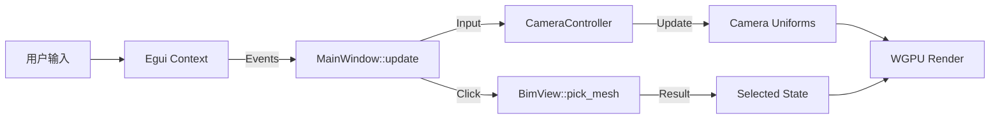

# 文档信息
- **文件名**: 交互实现机制
- **原始文件名**: 交互实现机制_id_13200000_level_2_parentId_13000000_time_20251226_Creator_lvwan01
- **Level**: 2
- **ID**: 13200000
- **ParentID**: 13000000
- **Time**: 20251226
- **Creator**: lvwan01

---

# 交互系统实现机制 (Interaction Implementation)

本文档详细描述了 BIMCHNA 系统中交互功能的底层实现原理、算法逻辑及核心代码结构。当前实现分布在 `crates/display` (核心逻辑) 和 `crates/app` (事件绑定) 中。

## 1. 视图控制原理 (View Control)

视图控制的核心在于维护摄像机（Camera）的状态，并将用户的输入（鼠标移动、键盘按键）映射为摄像机参数的变更。

### 1.1 坐标系定义
系统采用 **右手坐标系，Z轴向上 (Z-Up)**。
*   **X/Y**: 地面平面。
*   **Z**: 高度方向。
*   **Yaw (偏航角)**: 绕 Z 轴旋转的角度。
*   **Pitch (俯仰角)**: 与水平面的夹角。

### 1.2 轨道摄像机 (Orbit Camera)
默认交互模式，摄像机围绕一个**目标点 (Target)** 在球面上运动。

**核心算法**: 球坐标系转笛卡尔坐标系。
```rust
// 伪代码逻辑
let r = self.distance;
let x = r * self.pitch.cos() * self.yaw.cos();
let y = r * self.pitch.cos() * self.yaw.sin();
let z = r * self.pitch.sin();

camera.eye = self.target + Vec3::new(x, y, z);
camera.target = self.target;
```

### 1.3 平移 (Pan)
平移操作实际上是移动摄像机的**目标点 (Target)** 和 **视点 (Eye)**，保持二者相对位置不变。

**实现逻辑**:
1.  构建摄像机的局部坐标系基向量（Right, Up）。
2.  将屏幕空间的位移 `(dx, dy)` 投影到摄像机平面上。
3.  反向移动 Target。

```rust
// 计算 Right 向量 (假设 Z 为上向量)
// 注意：当视线平行于 Z 轴时需要特殊处理（Singularity）
let view_dir = (target - eye).normalize();
let right_dir = view_dir.cross(Vec3::Z).normalize();
let up_dir = right_dir.cross(view_dir).normalize();

// 应用位移
let factor = distance * scale;
self.target -= right_dir * dx * factor;
self.target += up_dir * dy * factor;
```

### 1.4 缩放 (Zoom)
*   **透视投影 (Perspective)**: 改变摄像机与目标点的距离 (`distance`)。
*   **正交投影 (Orthographic)**: 改变正交投影的视口宽度 (`ortho_width`)。

## 2. 物件拾取原理 (Object Picking)

拾取是将二维屏幕坐标转换为三维空间对象引用的过程。系统采用 **CPU 端射线检测 (Ray Casting)** 方案。

### 2.1 射线生成 (Ray Generation)
从屏幕像素坐标生成一条在世界空间中的射线。

**步骤**:
1.  **归一化设备坐标 (NDC)**: 将屏幕坐标 `(x, y)` 映射到 `[-1, 1]` 区间。注意 WGPU/Vulkan 的 NDC Y轴向下可能需要反转，且深度范围为 `[0, 1]`。
2.  **逆投影**: 使用 `ViewProjection` 矩阵的逆矩阵 (`InvVP`) 将 NDC 坐标下的 Near/Far 点变换回世界空间。
3.  **构建射线**: 起点为 Near Point，方向为 `(Far - Near).normalize()`。

```rust
// 核心代码片段 (Display/RHI)
let ndc_x = (x / width) * 2.0 - 1.0;
let ndc_y = 1.0 - (y / height) * 2.0; // Y轴翻转
let inv_vp = (projection * view).inverse();

let near_world = inv_vp * Vec4::new(ndc_x, ndc_y, 0.0, 1.0);
let far_world = inv_vp * Vec4::new(ndc_x, ndc_y, 1.0, 1.0);

let origin = near_world.truncate() / near_world.w;
let direction = (far_world.truncate() / far_world.w - origin).normalize();
```

### 2.2 求交测试 (Intersection Test)
为了保证性能，采用两级检测机制：

1.  **AABB 粗测 (Broad Phase)**:
    *   遍历场景中所有 Mesh。
    *   检测射线是否与 Mesh 的轴对齐包围盒 (AABB) 相交。
    *   算法：Slab Method。
    *   *优化*: 剔除不可见或背后的物体。

2.  **三角形精测 (Narrow Phase)**:
    *   对通过 AABB 测试的 Mesh，遍历其所有三角形。
    *   算法：Möller–Trumbore 射线三角求交算法。
    *   记录最近的交点距离 `t` (Hit Distance)。

```rust
// 遍历所有 Mesh
for (i, mesh) in meshes.enumerate() {
    // 1. AABB 测试
    if !ray_aabb(ray, mesh.aabb) { continue; }

    // 2. 三角形测试
    for triangle in mesh.triangles {
        if let Some(t) = ray_triangle(ray, triangle) {
            if t < closest_t {
                closest_t = t;
                picked_mesh = i;
            }
        }
    }
}
```

## 3. 事件处理管线 (Event Pipeline)

交互事件由 `egui` 捕获，在主循环中分发给控制器。

### 3.1 流程图


### 3.2 主要代码映射
*   **输入监听**: `crates/app/src/ui/mod.rs`
    *   `ctx.input(|i| ...)`: 获取键盘、鼠标状态。
    *   `response.dragged()`: 获取鼠标拖拽增量。
*   **状态更新**: `crates/display/src/scene.rs`
    *   `CameraController::rotate()`: 更新 Yaw/Pitch。
    *   `CameraController::pan()`: 更新 Target。
*   **渲染同步**: `crates/display/src/rhi.rs`
    *   `BimView::update_camera()`: 将逻辑摄像机状态写入 GPU Uniform Buffer。

## 4. 框选缩放 (Zoom Box) 实现
框选缩放是一种特殊的交互，涉及 2D UI 绘制与 3D 投影的结合。

1.  **UI 阶段**: 用户拖拽绘制 2D 矩形 (`egui::Painter`).
2.  **计算阶段**: 
    *   计算矩形中心点的 NDC 坐标。
    *   计算矩形在世界空间的投影范围。
    *   将摄像机 Target 移动到矩形中心对应的世界坐标点（通常投射到当前的 Target 平面上）。
    *   调整摄像机 Distance 或 FOV 以适配矩形大小。

## 5. 待优化项
1.  **BVH 加速**: 目前 Picking 采用线性遍历 AABB，对于海量物体场景（>10k objects）需引入 BVH (Bounding Volume Hierarchy) 加速结构。
2.  **GPU Picking**: 对于极其复杂的几何体，可考虑基于颜色编码的 GPU Picking 方案（渲染 ID 到纹理）。
3.  **操作解耦**: 将 `MainWindow` 中的输入逻辑抽离为独立的 `InputHandler` 或 `Tool` 状态机。

---
# 文档关系 (Document Relationships)
- **上级 (Parent)**: [[交互系统.md]]
- **下级 (Children)**: 无
