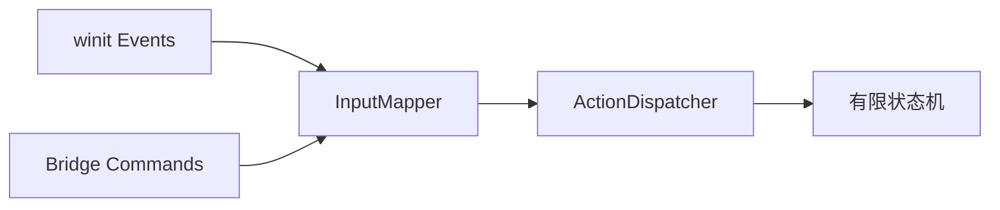

# 交互系统 (Interaction) 设计文档

**文档位置**: `crates/interaction/input_system.md`
**关联模块**: `bridge` (输入源), `kernel` (消费者)

## 1. 设计目标
统一处理来自不同源的输入事件（Native Window 的鼠标键盘、Web UI 的虚拟摇杆、VR 手柄等），并将它们转换为语义化的三维操作指令。

## 2. 输入管线 (Input Pipeline)



### 2.1 原始事件 (Raw Events)
定义最底层的输入抽象，屏蔽平台差异。
```rust
pub enum RawInput {
    MouseMove { x: f32, y: f32 },
    MouseClick { button: MouseButton, state: ElementState },
    Keyboard { key: VirtualKeyCode, state: ElementState },
    Gesture { type: GestureType, delta: f32 }, // 触摸屏捏合等
}
```

### 2.2 语义动作 (Semantic Actions)
将原始事件映射为业务意图。支持用户自定义快捷键绑定。
```rust
pub enum Action {
    PanCamera(Vec2),
    OrbitCamera(Vec2),
    ZoomCamera(f32),
    Select(Vec2),
    Cancel, // ESC
    Confirm, // Enter
}
```

## 3. 状态机 (FSM) 管理
交互逻辑是高度状态相关的。
*   **Idle**: 空闲状态，鼠标移动仅做高亮检测 (Hover)。
*   **Orbiting**: 按住中键旋转相机。
*   **Sketching**: 正在绘制草图，点击左键添加点。

```rust
trait InteractionState {
    fn on_action(&mut self, action: Action, ctx: &mut Context) -> Transition;
}
```

## 4. 射线检测 (Raycasting)
这是交互系统的核心能力。
*   **输入**: 屏幕坐标 $(x, y)$ + 相机 View/Projection 矩阵。
*   **计算**: 生成一条射线 $Origin + t \cdot Direction$。
*   **输出**: 击中的 Entity ID 和击中点坐标。
*   **实现位置**: `interaction` 模块负责生成射线，调用 `geometry` 模块的加速结构（如 BVH）进行查询。

## 5. 与其他模块的协作
*   **Kernel**: Interaction 模块计算出结果（如“选中了物体 A”）后，发送 Command 给 Kernel 修改数据。
*   **Bridge**: 当状态机发生变化（如从 Idle 进入 Sketching），通知 Bridge 更新前端光标样式（如变为十字准星）。

