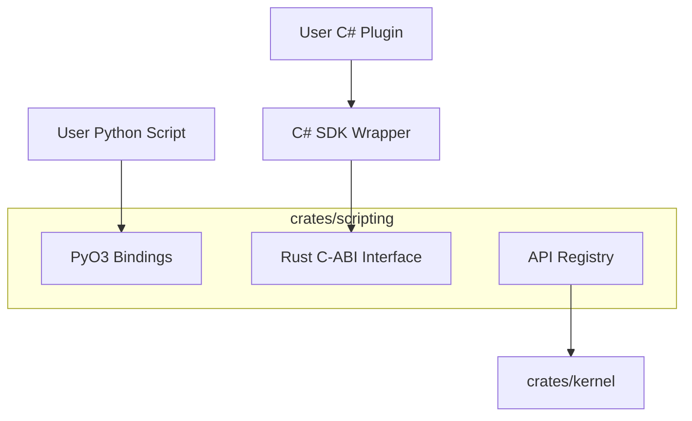

# 二次开发/脚本系统架构 (Scripting & Plugin System)

**文档位置**: `crates/scripting/architecture.md`
**关联模块**: `kernel` (API 提供者), `bridge` (IPC 备选)

## 1. 设计目标
支持用户使用 **Python** 和 **C#** 编写插件，扩展程序功能。
*   **Python**: 侧重于快速脚本、自动化任务、算法验证（利用 numpy/scipy 生态）。
*   **C#**: 侧重于构建复杂的 UI 插件、对接企业级系统（利用 .NET 生态）。

## 2. 总体架构：API 中间层

为了避免 Kernel 代码被脚本系统的胶水代码污染，我们引入 **Scripting API Layer**。



## 3. Python 支持 (Embedded Python)

使用 **[pyo3](https://github.com/PyO3/pyo3)** 将 Rust 核心功能暴露为 Python 模块。

### 3.1 实现逻辑
1.  **嵌入解释器**: 在 App 启动时，初始化 Python VM。
2.  **模块导出**:
    ```rust
    #[pymodule]
    fn bim_api(_py: Python, m: &PyModule) -> PyResult<()> {
        m.add_function(wrap_pyfunction!(create_wall, m)?)?;
        m.add_class::<PyEntity>()?;
        Ok(())
    }
    ```
3.  **用户调用**:
    ```python
    import bim_api
    wall = bim_api.create_wall(start=(0,0), end=(10,0), thickness=0.5)
    wall.set_material("Brick")
    ```
4.  **事件回调**: 允许 Python 注册回调函数（如 `on_selection_changed`），Rust 在特定时机调用这些 Python 函数。

## 4. C# 支持 (Native Interop)

由于 C# 也是编译型/强类型语言，通过 **C-ABI (C Application Binary Interface)** 进行交互是性能最高的方式。

### 4.1 Rust 侧 (C Exports)
暴露纯 C 函数，避免 Rust 特有的泛型或生命周期暴露给外部。
```rust
#[no_mangle]
pub extern "C" fn bim_create_wall(x1: f32, y1: f32, x2: f32, y2: f32) -> u32 {
    // 调用 Kernel 逻辑，返回 Entity ID
    Kernel::instance().create_wall(...)
}
```

### 4.2 C# 侧 (SDK 封装)
不让用户直接写 `extern` 方法，而是提供一个优雅的 SDK。

```csharp
// BIM.SDK.dll
public class Wall : Entity {
    public static Wall Create(Vector2 start, Vector2 end) {
        uint id = NativeMethods.bim_create_wall(start.x, start.y, end.x, end.y);
        return new Wall(id);
    }
}

// 用户代码
var wall = Wall.Create(new Vector2(0,0), new Vector2(10,0));
```

## 5. 线程安全与并发控制

这是一个关键难点。脚本通常运行在独立线程或主线程，而 Rust Kernel 也有自己的状态保护。

*   **Global Interpreter Lock (GIL)**: Python 有 GIL，多线程访问受限。建议 Python 脚本在主线程的“脚本时间片”内执行，或者通过 **Task Queue** 异步执行。
*   **Command Pattern**: 脚本不要直接修改 Kernel 内存。脚本调用 API -> 生成 `Command` -> 放入 Kernel 队列 -> Kernel 在下一帧 Update 时执行。这保证了线程安全。

## 6. 插件加载机制

*   **Python**: 扫描 `plugins/*.py`，使用 `Python::import` 动态加载。
*   **C#**: 扫描 `plugins/*.dll`，使用 .NET 的 `Assembly.Load` 加载，并查找实现了 `IPlugin` 接口的类。

