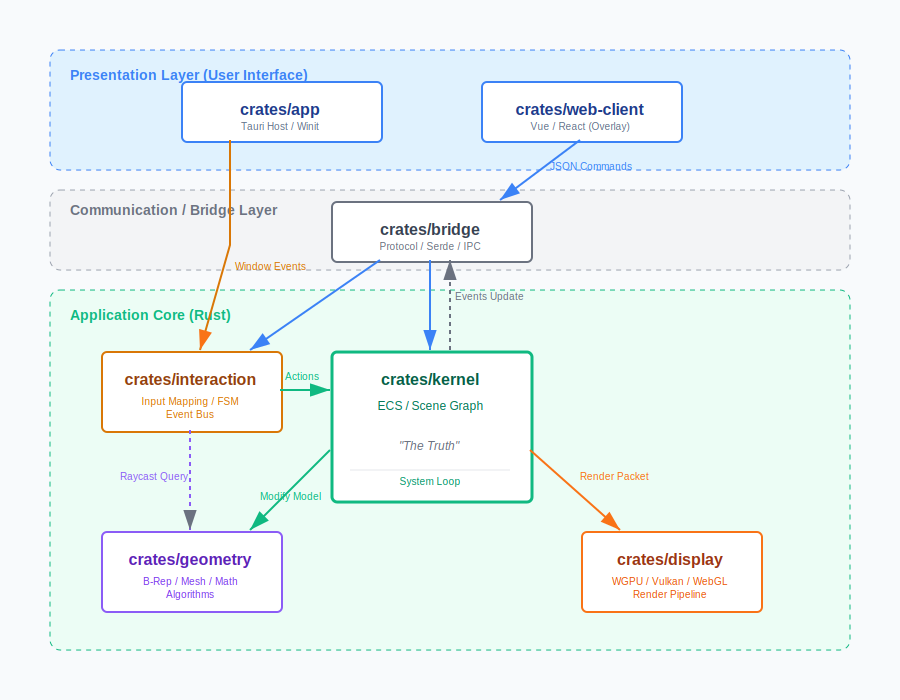
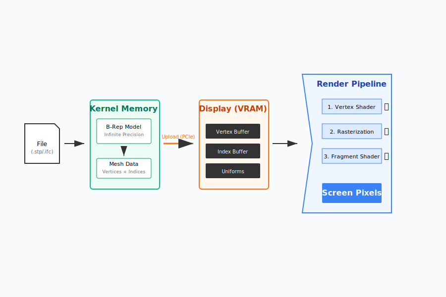

# 文档信息
- **文件名**: 总框架
- **Level**: 0
- **ID**: 00000000
- **ParentID**: null
- **Time**: 20251218
- **Creator**: lvwan01

---

# 软件总框架设计书 (General Architecture)

## 1. 项目概述 (Project Overview)

### 1.1 项目愿景
开发一款高性能、跨平台的三维建模与渲染软件（对标 Rhino）。核心目标是构建一个架构完整、模块高度解耦、操作全流程可追溯（Undo/Redo）且具备高度可维护性的下一代 CAID（计算机辅助工业设计）工具。
本项目采用 **“双模架构” (Dual-Mode Architecture)**，旨在同时支持高性能原生桌面应用 (Native) 和轻量级 Web 应用 (Browser)，共享 90% 的 Rust 核心代码。

### 1.2 设计哲学
*   **文档驱动**: 设计先行，代码紧随。
*   **模块化**: 强解耦设计，各模块通过标准接口（Trait/Interface）通信。
*   **命令化**: 一切操作皆命令，确保用户行为可记录、可撤销、可重放。
*   **AI Native**: 核心架构原生支持 AI 交互，集成大模型辅助设计、编码与自动化。
*   **双模渲染**: 基于 wgpu 实现一套代码同时驱动 Vulkan/Metal (Native) 和 WebGL/WebGPU (Web)。

## 2. 技术架构 (Technical Architecture)

为了实现高效开发与高性能运行的平衡，本项目采纳以下技术栈：

*   **核心语言**: **Rust** (内存安全，强类型系统，WASM 支持)
*   **应用框架**: **Tauri v2** (Native 宿主) / **WASM** (Web 宿主)
*   **图形后端**: **wgpu** (统一抽象层，适配 Vulkan/DX12/Metal/WebGPU)
*   **前端框架**: **Vue 3 + TypeScript** (负责 UI 呈现，通过 Bridge 与 Rust 通信)
*   **几何内核**: 自研/集成 B-Rep 内核 (参考 `truck` 或 `parry`)

## 3. 核心模块详解 (Core Modules)

### 3.1 基础设施层 (Infrastructure) - Level 1
*   **ID**: `10000000`
*   **功能**: 提供全局通用的基础服务。
*   **核心组件**:
    *   **日志系统**: 统一的结构化日志。
    *   **数学库**: 基于 `glam` (Vec3, Mat4, Quat)。
    *   **ECS 基础**: 实体组件系统基础类型。

### 3.2 几何内核 (Geometry Kernel) - Level 1
*   **ID**: `11000000`
*   **功能**: 处理纯数学几何计算，维护数据的数学真值 (The Truth)。
*   **子模块**:
    *   **Basic Geometry**: 基础图元 (点, 线, 面)。
    *   **Curves/Surfaces**: NURBS 曲线与曲面算法。
    *   **B-Rep**: 边界表示拓扑结构。
    *   **Algorithms**: 布尔运算、求交、投影等核心算法。

### 3.3 显示引擎 (Display Engine) - Level 1
*   **ID**: `12000000`
*   **功能**: 将几何数据转化为屏幕上的可视化图像 (The Proxy)。
*   **核心组件**:
    *   **RHI**: 基于 `wgpu` 的渲染硬件接口。
    *   **Render Graph**: 可配置的渲染管线图。
    *   **Scene Manager**: 渲染场景图管理 (Light, Camera, Mesh)。
    *   **Shader System**: WGSL 实现 PBR 渲染。

### 3.4 交互与输入系统 (Interaction & Input) - Level 1
*   **ID**: `13000000`
*   **功能**: 处理用户输入、事件分发及状态机管理。
*   **核心组件**:
    *   **Input Manager**: 统一 Native 和 Web 的输入事件 (Mouse, Keyboard, Touch)。
    *   **Interaction Bus**: 交互事件总线 (`Select`, `Hover`, `Orbit`)。
    *   **State Machine**: 编辑器状态管理 (Idle, Drawing, transforming)。
    *   **Tool System**: 抽象工具接口 (LineTool, BoxTool)。

### 3.5 核心逻辑层 (Kernel) - Level 1
*   **ID**: `02000000`
*   **功能**: 应用程序的“大脑”，协调几何、显示与交互。
*   **核心组件**:
    *   **Scene Graph**: 维护业务层面的场景层级结构。
    *   **System Loop**: 主循环驱动 (Input -> Update -> Render Sync)。
    *   **Entity Data**: 链接 Geometry 数据与 Render Proxy。

### 3.6 数据模型与持久化 (Storage) - Level 1
*   **ID**: `14000000`
*   **功能**: 数据的序列化、反序列化与交换。
*   **核心组件**:
    *   **Format**: 自定义文件格式定义。
    *   **Exchange**: 外部格式导入导出 (FBX, OBJ, STL)。

### 3.7 AI 系统 (AI System) - Level 1
*   **ID**: `15000000`
*   **功能**: 智能化服务层。
*   **核心组件**:
    *   **AI Service**: 大模型接入 (Deepseek, OpenAI)。
    *   **Smart Command**: 自然语言转 CAD 命令 ("创建一个半径为5的红球")。
    *   **Script Copilot**: 脚本编写辅助与错误自动修复。
    *   **RAG System**: 基于文档数据库的智能问答。

### 3.8 前端与桥接 (Web Client & Bridge) - Level 1
*   **ID**: `18000000` / `17000000`
*   **功能**: 用户界面与底层通信。
*   **核心组件**:
    *   **Bridge Protocol**: 定义 JSON 通信协议 (Command/Event)。
    *   **Overlay UI**: 透明叠加的 Vue 3 界面。
    *   **Tauri/WASM Adapter**: 适配不同宿主环境的通信层。

## 4. 扩展性设计 (Extensibility)
*   **脚本系统 (ID: 16000000)**: 支持 Python/Lua 运行时，通过 FFI 调用 Kernel 接口。
*   **插件架构**: 基于动态链接库 (DLL/WASM) 的功能扩展机制。

## 5. 开发原则与规范 (Development Standards)
1.  **文档驱动**: 更新 Markdown 文档 -> AI 辅助编码。
2.  **ID 规范**: 8 位编码 (L0: `00000000`, L1: `1xxxxxxx`)。
3.  **Rust 优先**: 核心逻辑全 Rust，UI 逻辑 TypeScript。
4.  **测试驱动**: 关键算法需包含单元测试。
